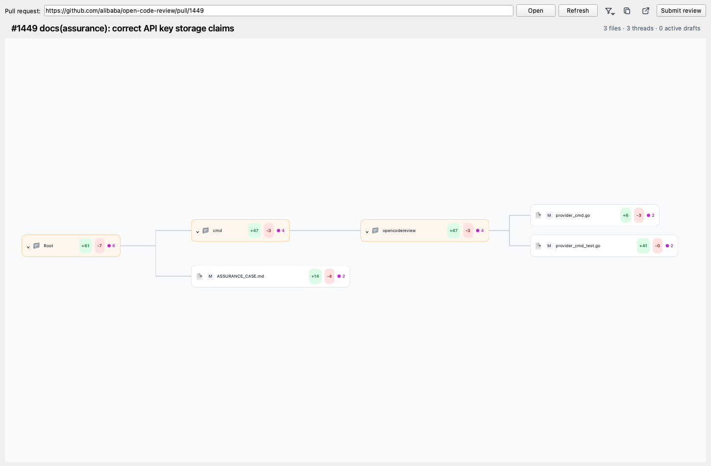

# diffy

A native macOS pull request review application built with PySide6 and the GitHub CLI.



See the [product tour](docs/product-tour.md) for an overview of the review workflow.

## Development

```bash
uv sync
uv run diffy https://github.com/owner/repository/pull/123
```

Regenerate the screenshots and Markdown for the [product tour](docs/product-tour.md):

```bash
make tour
```

Authentication is provided by the local `gh` installation.

## Logs

Application logs are written to `~/Library/Logs/diffy/diffy.log`. Files rotate at 5 MiB with five backup files retained.
