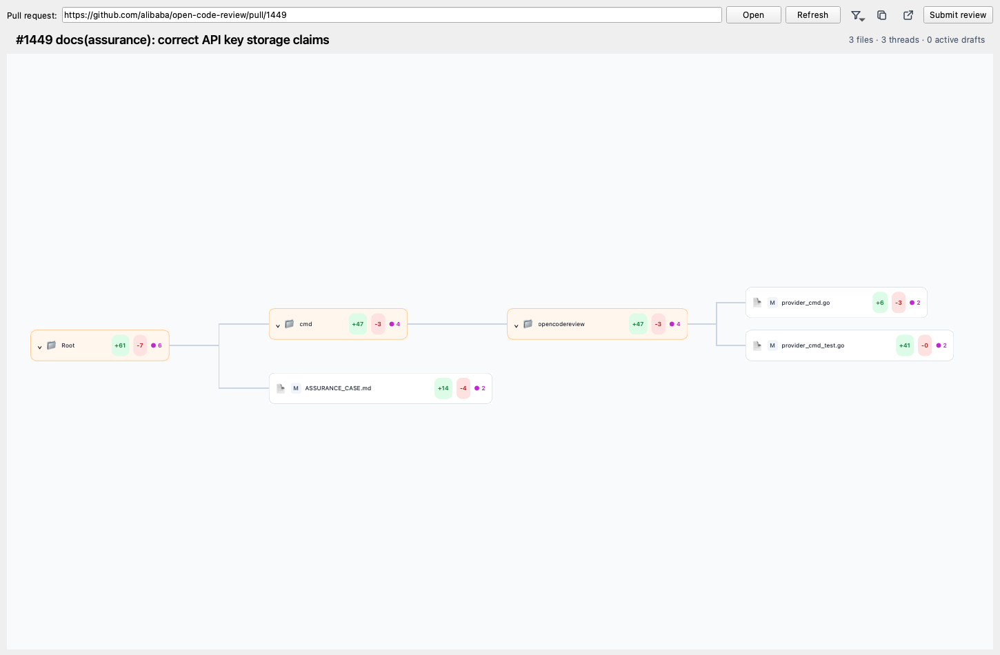

# diffy

A native macOS pull request review application built with PySide6 and the GitHub CLI.



See the [product tour](docs/product-tour.md) for an overview of the review workflow.

## Development

```bash
uv sync
uv run diffy https://github.com/owner/repository/pull/123
```

Regenerate the screenshots and Markdown for the [product tour](docs/product-tour.md):

```bash
make tour
```

Authentication is provided by the local `gh` installation.

## Structural change parsing

Diffy builds syntax-aware change summaries for C, C++, C#, CSS, Dart, Go, HTML, Java, JavaScript, JSON, Kotlin, Lua, Markdown, PHP, Python, Ruby, Rust, Scala, shell scripts, SQL, Swift, TOML, TypeScript, TSX, XML, YAML, and Zig files. The Canvas shows an AST badge on each file; hover it to see changed syntax nodes and line locations. Unsupported files, unavailable source snapshots, and partial or failed parses remain reviewable through the existing line-based diff.

## Logs

Application logs are written to `~/Library/Logs/diffy/diffy.log`. Files rotate at 5 MiB with five backup files retained.
