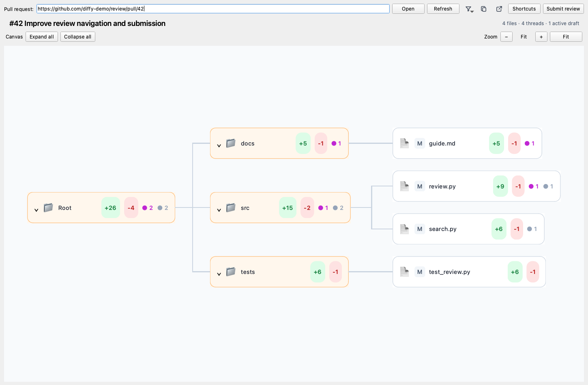
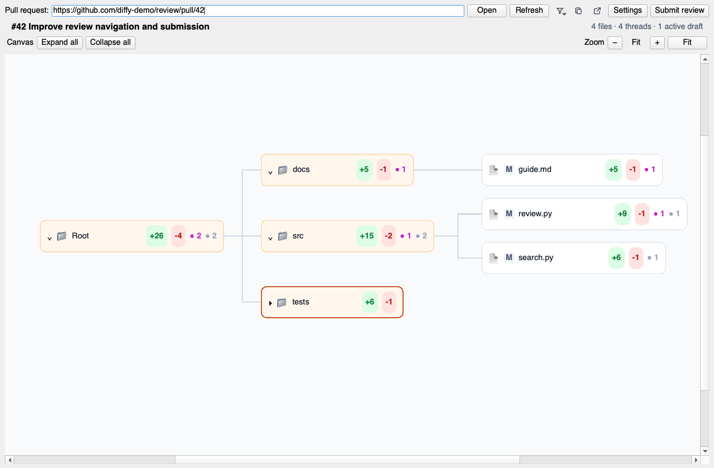
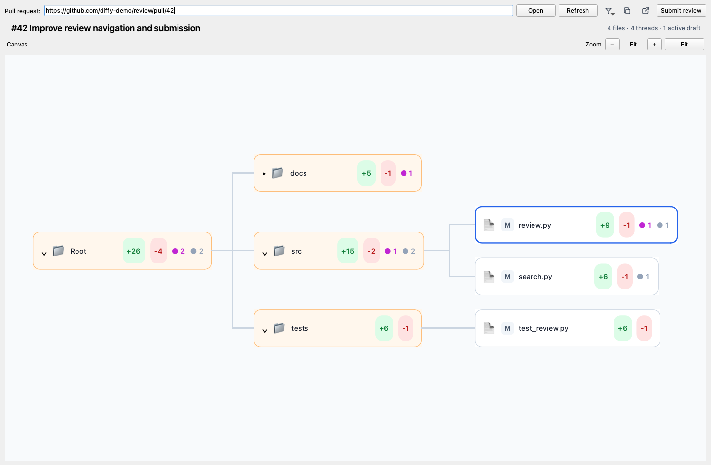
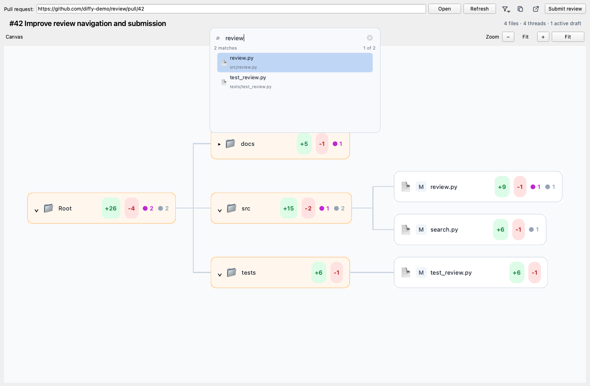
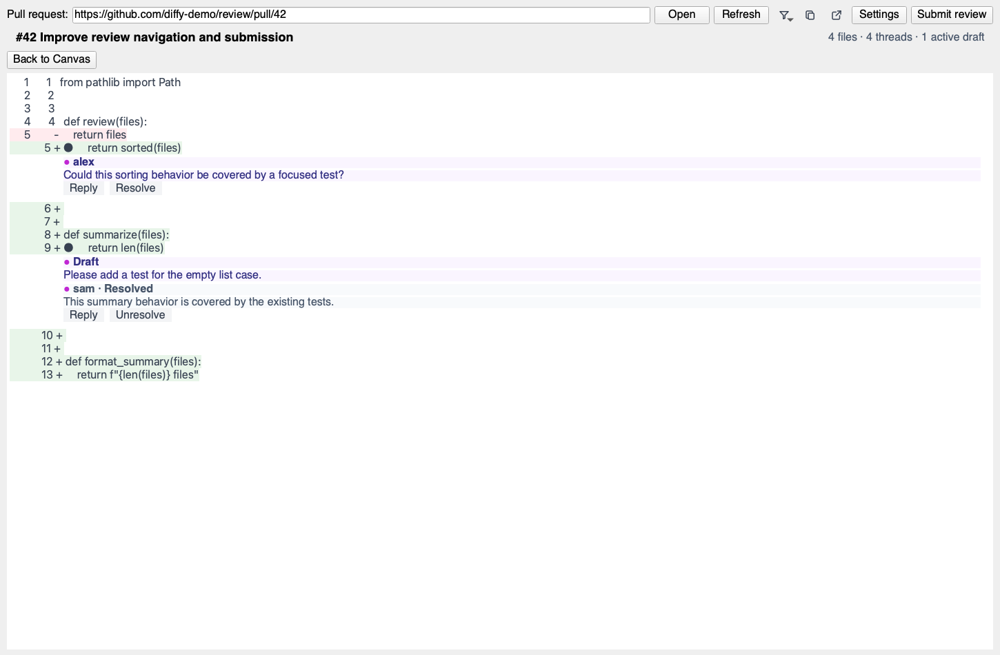
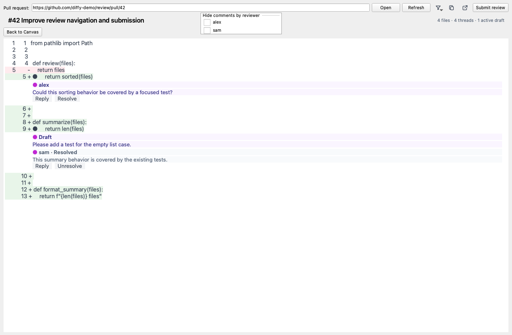
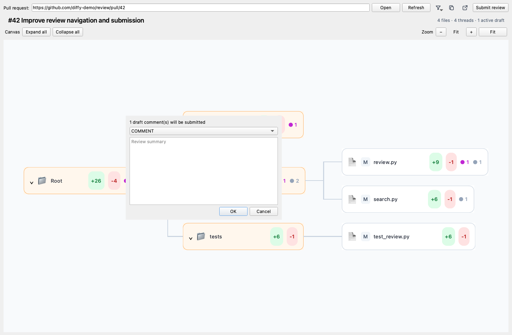

# diffy product tour

Generated by `make tour`. Do not edit the screenshots manually.

## Canvas overview

Navigate the pull request through a compact file tree with change and comment badges; use the visible −, +, Fit, mouse-wheel, or trackpad pinch controls to manage large trees.

## Keyboard navigation

Move through the tree with the arrow keys and expand or collapse folders with Space.

## Open and resolved comments

A file with both states shows purple open comments and gray resolved comments beside its change badges.

## Quick search

Press Cmd+Shift+F to search files and highlight the selected result in the canvas.

## Diff and inline comments

Review changed lines with inline threads, draft comments, and Reply or Resolve actions.

## Reviewer filtering

Hide comments from selected reviewers while keeping the diff and canvas counts in sync.

## Submit review

Submit a review summary and draft line comments as a comment, approval, or change request.

